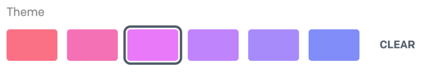
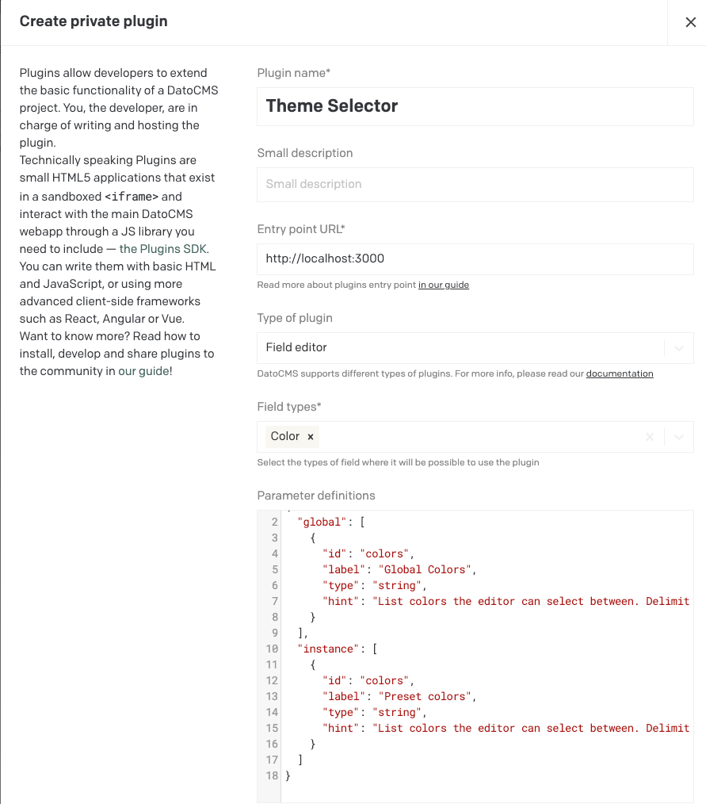

# DatoCMS Theme Selector

A plugin for DatoCMS that allows you select a color from a predefined list. The
normal `color` field opens a color picker, but doesn't enforce a fixed set of
colors.



## Configuration

Make sure you apply the plugin on a color field, and fill out the preset color
list. You can define a default set of colors globally, and override them on an
instance. Use the global option if you have default set of values you should be
able to select from.

A valid list of colors could look like this:

```
#feb2b2, #fc8181, #f56565, #e53e3e, #c53030
```

### Development

The plugin is built using [Vite.js](https://vitejs.dev/). This enables a fast development workflow, where
you see the changes as soon as you save a file. For it to work, it needs to
be rendered inside the DatoCMS interface.

So when testing the plugin locally, you should [create a new plugin](https://www.datocms.com/docs/building-plugins/creating-a-new-plugin) in a DatoCMS
project, and point it to `http://localhost:3000`.


